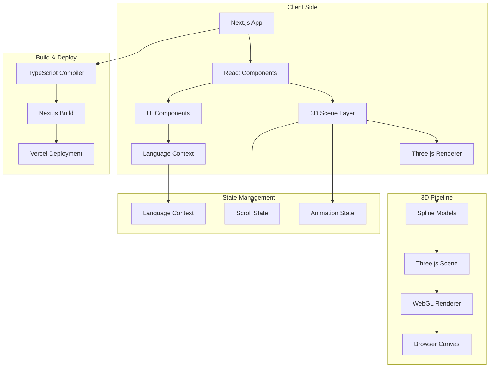
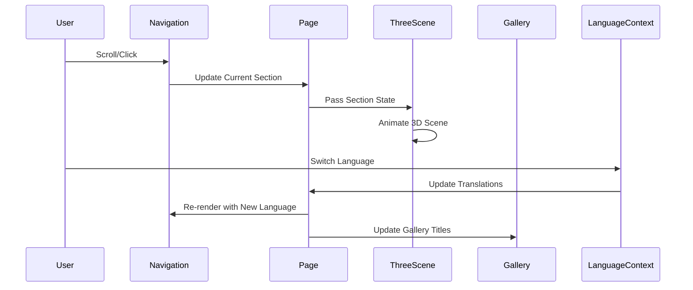

<div align="center"><a name="readme-top"></a>

[](#)

# 🚀 Forward with Her<br/><h3>Mentorship Program Website</h3>

An innovative mentorship platform that leverages cutting-edge 3D technology to connect female professionals in tech.<br/>
Features interactive 3D animations, bilingual support, and responsive design with modern user experience.<br/>
One-click **FREE** deployment of your mentorship community platform.

[Live Website][project-link] · [GitHub Repository][github-repo] · [Documentation][docs] · [Issues][github-issues-link]

<br/>

[][project-link]

<br/>

<!-- SHIELD GROUP -->

[![][github-release-shield]][github-release-link]
[![][vercel-shield]][vercel-link]
[![][github-stars-shield]][github-stars-link]
[![][github-forks-shield]][github-forks-link]
[![][github-issues-shield]][github-issues-link]
[![][github-license-shield]][github-license-link]<br>

**Share Project Repository**

[![][share-x-shield]][share-x-link]
[![][share-telegram-shield]][share-telegram-link]
[![][share-whatsapp-shield]][share-whatsapp-link]
[![][share-reddit-shield]][share-reddit-link]
[![][share-linkedin-shield]][share-linkedin-link]

<sup>🌟 Empowering women in tech through innovative mentorship experiences. Built for the next generation of female tech leaders.</sup>

## 📸 Project Screenshots

> [!TIP]
> Experience the immersive 3D interface and responsive design that makes mentorship engaging and accessible.

<div align="center">
  
  <p><em>Interactive 3D Scene with Section-based Animations</em></p>
</div>

<div align="center">
  
  
  <p><em>Responsive Design - Desktop and Mobile Experience</em></p>
</div>

<details>
<summary><kbd>📱 More Screenshots</kbd></summary>

<div align="center">
  
  <p><em>Auto-Scrolling Gallery with Hover Interactions</em></p>
</div>

<div align="center">
  
  <p><em>Program Schedule and Requirements Section</em></p>
</div>

</details>

## 🎬 Demo Video

> [!NOTE]
> Watch the interactive 3D animations and smooth section transitions in action.

<div align="center">

https://github.com/user-attachments/assets/6fab597d-5b23-462d-9dfe-0b9c4bb7e6e5

*Interactive 3D scene responding to scroll and section changes*

</div>

**Tech Stack Badges:**

<div align="center">

 
 
 
 
 
 

</div>

</div>

> [!IMPORTANT]
> This project demonstrates modern full-stack development with 3D web technologies. It combines Next.js 15 with Three.js to provide immersive user experiences. Features include interactive 3D animations, bilingual support, responsive design, and auto-scrolling galleries.

<details>
<summary><kbd>📑 Table of Contents</kbd></summary>

#### TOC

- [🚀 Forward with Her](#-forward-with-her)
      - [TOC](#toc)
  - [🌟 Introduction](#-introduction)
  - [✨ Key Features](#-key-features)
    - [`1` Interactive 3D Animations](#1-interactive-3d-animations)
    - [`2` Bilingual Support System](#2-bilingual-support-system)
    - [`*` Additional Features](#-additional-features)
  - [🛠️ Tech Stack](#️-tech-stack)
  - [🏗️ Architecture](#️-architecture)
    - [System Architecture](#system-architecture)
    - [Component Structure](#component-structure)
  - [⚡️ Performance](#️-performance)
  - [🚀 Getting Started](#-getting-started)
    - [Prerequisites](#prerequisites)
    - [Quick Installation](#quick-installation)
    - [Environment Setup](#environment-setup)
    - [Development Mode](#development-mode)
  - [🛳 Deployment](#-deployment)
    - [`A` Cloud Deployment](#a-cloud-deployment)
    - [`B` Docker Deployment](#b-docker-deployment)
  - [📖 Usage Guide](#-usage-guide)
    - [Basic Usage](#basic-usage)
    - [Customization](#customization)
  - [⌨️ Development](#️-development)
    - [Local Development](#local-development)
    - [Adding Features](#adding-features)
  - [🤝 Contributing](#-contributing)
  - [📄 License](#-license)
  - [👥 Team](#-team)

####

<br/>

</details>

## 🌟 Introduction

We are passionate developers creating next-generation mentorship solutions for women in tech. By adopting modern 3D web technologies and intuitive design principles, we aim to provide users with engaging, interactive experiences that make professional networking and mentorship more accessible and inspiring.

Whether you're a potential mentor, mentee, or program administrator, this platform provides an immersive environment to explore mentorship opportunities. The project combines cutting-edge technologies with thoughtful UX design to create memorable interactions.

> [!NOTE]
> - Node.js >= 18.0 required
> - Modern browser with WebGL support for 3D features
> - Responsive design optimized for desktop and mobile
> - Bilingual support (English/Chinese) included by default

| [![][demo-shield-badge]][project-link]   | No installation required! Visit our live demo to experience the 3D interactions firsthand.                           |
| :------------------------------------ | :--------------------------------------------------------------------------------------------- |
| [![][github-shield-badge]][github-repo] | Join our community! Connect with developers and contribute to empowering women in tech. |

> [!TIP]
> **⭐ Star us** to receive all release notifications from GitHub without delay!

<details>
  <summary><kbd>⭐ Star History</kbd></summary>
  <picture>
    <source media="(prefers-color-scheme: dark)" srcset="https://api.star-history.com/svg?repos=ChanMeng666%2Fforward-with-her-mentorship-program&theme=dark&type=Date">
    
  </picture>
</details>

## ✨ Key Features

### `1` [Interactive 3D Animations][docs-3d-features]

Experience next-generation web 3D technology with our immersive scene that responds to user interactions and scroll position. Our innovative approach provides unprecedented visual engagement through advanced Three.js integration and Spline 3D models.

<div align="center">
  
  <p><em>Dynamic 3D scene with section-responsive animations</em></p>
</div>

Key capabilities include:
- 🚀 **Real-time Rendering**: Smooth 60fps 3D animations with WebGL
- 🔧 **Scroll Integration**: Scene transforms based on page scroll position
- 📱 **Responsive 3D**: Optimized rendering for both desktop and mobile devices
- 🛡️ **Performance Optimized**: Efficient loading and rendering pipeline

> [!TIP]
> The 3D scene dynamically changes its animation style and camera position based on the current section being viewed, creating a cohesive narrative experience.

[![][back-to-top]](#readme-top)

### `2` [Bilingual Support System][docs-i18n]

Revolutionary internationalization system that transforms how users interact with content. With our advanced React Context-based translation system, users can seamlessly switch between English and Chinese while maintaining consistent user experience.

<div align="center">
  
  
  <p><em>Seamless Language Switching - English (left) and Chinese (right)</em></p>
</div>

**Available Languages:**
- **English**: Complete professional terminology with tech industry focus
- **Chinese**: Native Chinese translations with cultural context adaptation

[![][back-to-top]](#readme-top)

### `*` Additional Features

Beyond the core features, this project includes:

- [x] 💨 **Auto-Scrolling Gallery**: Smooth infinite scroll with pause-on-hover functionality
- [x] 🌐 **Multi-Section Layout**: Organized content presentation with smooth navigation
- [x] 🔒 **Modern Design**: Beautiful UI with custom color schemes and typography
- [x] 💎 **Responsive Layout**: Mobile-first design with desktop optimization
- [x] 🗣️ **Real-time Updates**: Dynamic content loading and smooth transitions
- [x] 📊 **Performance Optimized**: Image optimization and lazy loading
- [x] 🔌 **Extensible**: Modular component architecture for easy customization
- [x] 📱 **Touch Support**: Mobile gesture support for gallery interactions

> ✨ More features are continuously being added as the project evolves.

<div align="right">

[![][back-to-top]](#readme-top)

</div>

## 🛠️ Tech Stack

<div align="center">
  <table>
    <tr>
      <td align="center" width="96">
        
        <br>Next.js 15
      </td>
      <td align="center" width="96">
        
        <br>React 19
      </td>
      <td align="center" width="96">
        
        <br>TypeScript 5
      </td>
      <td align="center" width="96">
        
        <br>Three.js
      </td>
      <td align="center" width="96">
        
        <br>Tailwind CSS
      </td>
      <td align="center" width="96">
        
        <br>Vercel
      </td>
    </tr>
  </table>
</div>

**Frontend Stack:**
- **Framework**: Next.js 15 with App Router for optimal performance
- **Language**: TypeScript for type safety and better developer experience
- **Styling**: Tailwind CSS with custom design system
- **3D Graphics**: Three.js 0.149.0 + Spline Tool integration
- **State**: React Context for language management
- **UI Components**: Custom components with Lucide React icons

**Development Tools:**
- **Build Tool**: Next.js built-in bundler with optimization
- **Code Quality**: ESLint + TypeScript for code consistency
- **Version Control**: Git with conventional commits
- **Package Manager**: NPM with lockfile for dependency consistency

> [!TIP]
> Each technology was carefully selected for production readiness, developer experience, and optimal performance for 3D web applications.

## 🏗️ Architecture

### System Architecture

> [!TIP]
> This architecture supports component-based development and modern React patterns, making it scalable and maintainable for team collaboration.



### Component Structure

<div align="center">
  
  <p><em>Modular Component Architecture Overview</em></p>
</div>

```
src/
├── app/                          # Next.js App Router
│   ├── layout.tsx               # Root layout with providers
│   ├── page.tsx                 # Main application page
│   ├── globals.css              # Global styles
│   └── favicon.ico              # App icon
├── components/                   # Reusable UI components
│   ├── AnimatedThreeScene.tsx   # 3D scene with animations
│   ├── AutoScrollGallery.tsx    # Infinite scroll gallery
│   ├── Navigation.tsx           # Responsive navigation
│   ├── LanguageSwitcher.tsx     # Language toggle
│   ├── Footer.tsx               # Site footer
│   └── DynamicHead.tsx          # Dynamic meta tags
├── contexts/                     # React contexts
│   └── LanguageContext.tsx      # i18n state management
├── config/                       # Configuration files
│   └── metadata.ts              # Site metadata
└── styles/                       # Additional styles
```

### Data Flow Architecture



## ⚡️ Performance

> [!NOTE]
> Optimized for 3D web applications with efficient rendering and responsive design across devices.

### Performance Metrics

**Key Metrics:**
- ⚡ **90+ Lighthouse Score** for Performance and Accessibility
- 🚀 **< 2s** Initial page load with 3D assets
- 💨 **60fps** Smooth 3D animations
- 📊 **< 5MB** Total bundle size with 3D assets
- 🔄 **Instant** Language switching without reload

**Performance Optimizations:**
- 🎯 **Dynamic Imports**: 3D components loaded only when needed
- 📦 **Code Splitting**: Automatic route-based splitting
- 🖼️ **Image Optimization**: Next.js Image component with WebP support
- 🔄 **3D Optimization**: Efficient Three.js scene management with proper disposal

> [!NOTE]
> Performance metrics measured using Lighthouse and real-world testing across different devices and network conditions.

## 🚀 Getting Started

### Prerequisites

> [!IMPORTANT]
> Ensure you have the following installed:

- Node.js 18.0+ ([Download](https://nodejs.org/))
- npm/yarn/pnpm package manager
- Git ([Download](https://git-scm.com/))
- Modern browser with WebGL support

### Quick Installation

**1. Clone Repository**

```bash
git clone https://github.com/ChanMeng666/forward-with-her-mentorship-program.git
cd forward-with-her-mentorship-program
```

**2. Install Dependencies**

```bash
# Using npm
npm install

# Using yarn
yarn install

# Using pnpm (recommended)
pnpm install
```

**3. Start Development Server**

```bash
npm run dev
```

🎉 **Success!** Open [http://localhost:3000](http://localhost:3000) to view the application.

### Environment Setup

The application works out-of-the-box without additional environment variables for basic functionality.

### Development Mode

```bash
# Start development server with hot reload
npm run dev

# Build for production
npm run build

# Start production server
npm run start

# Run linting
npm run lint
```

## 🛳 Deployment

> [!IMPORTANT]
> The application is optimized for modern deployment platforms with built-in Next.js support.

### `A` Cloud Deployment

**Vercel (Recommended)**

[](https://vercel.com/new/clone?repository-url=https%3A%2F%2Fgithub.com%2FChanMeng666%2Fforward-with-her-mentorship-program)

**Manual Deployment:**

```bash
# Install Vercel CLI
npm i -g vercel

# Deploy to Vercel
vercel --prod
```

**Other Platforms:**

<div align="center">

|           Deploy with Netlify            |                     Deploy with Railway                      |
| :-------------------------------------: | :---------------------------------------------------------: |
| [](https://app.netlify.com/start/deploy?repository=https://github.com/ChanMeng666/forward-with-her-mentorship-program) | [](https://railway.app/new/template?template=https://github.com/ChanMeng666/forward-with-her-mentorship-program) |

</div>

### `B` Docker Deployment

```bash
# Build Docker image
docker build -t forward-with-her .

# Run container
docker run -p 3000:3000 forward-with-her
```

## 📖 Usage Guide

### Basic Usage

**Getting Started:**

1. **Explore Sections** - Scroll through different content sections
2. **Interactive 3D** - Watch the 3D scene respond to your navigation  
3. **Language Toggle** - Switch between English and Chinese
4. **Gallery Interaction** - Hover over gallery to pause auto-scroll

#### User Interface Walkthrough

<div align="center">
  
  <p><em>Main interface with 3D scene and content sections</em></p>
</div>

### Customization

**Adding New Languages:**

```typescript
// src/contexts/LanguageContext.tsx
export const translations = {
  en: { /* existing translations */ },
  zh: { /* existing translations */ },
  // Add new language
  es: {
    'nav.intro': 'Introducción',
    'nav.gallery': 'Galería',
    // ... other translations
  }
};
```

**Customizing 3D Animations:**

```typescript
// src/components/AnimatedThreeScene.tsx
const sectionAnimations = {
  'introduction': {
    rotation: new THREE.Euler(0, Math.PI * 1.5, -Math.PI * 0.1),
    animation: {
      rotationSpeed: 0.001,
      swayAmount: 0.1,
      swaySpeed: 0.001
    }
  },
  // Add custom section animations
};
```

## ⌨️ Development

### Local Development

**Setup Development Environment:**

```bash
# Clone and setup
git clone https://github.com/ChanMeng666/forward-with-her-mentorship-program.git
cd forward-with-her-mentorship-program
npm install

# Start development server
npm run dev
```

**Development Scripts:**

```bash
# Development
npm run dev          # Start dev server with hot reload
npm run build        # Build for production
npm run start        # Start production server
npm run lint         # Run ESLint

# File watching and development
npm run dev -- --turbo  # Enable Turbopack (experimental)
```

### Adding Features

> [!TIP]
> Follow our component-based architecture when adding new features.

**1. Create New Component:**

```typescript
// src/components/NewFeature.tsx
'use client';

import React from 'react';
import { useLanguage } from '@/contexts/LanguageContext';

export default function NewFeature() {
  const { t } = useLanguage();
  
  return (
    <div className="new-feature">
      <h2>{t('newFeature.title')}</h2>
      {/* Component implementation */}
    </div>
  );
}
```

**2. Add Translations:**

```typescript
// src/contexts/LanguageContext.tsx
export const translations = {
  en: {
    // existing translations...
    'newFeature.title': 'New Feature',
  },
  zh: {
    // existing translations...
    'newFeature.title': '新功能',
  }
};
```

**3. Integration Guidelines:**

- ✅ Follow TypeScript best practices
- ✅ Add responsive design classes
- ✅ Include proper accessibility attributes
- ✅ Add loading states for async operations
- ✅ Follow existing naming conventions

## 🤝 Contributing

We welcome contributions! Here's how you can help improve this project:

**Quick Start:**

```bash
# Fork and clone the repository
git clone https://github.com/YOUR_USERNAME/forward-with-her-mentorship-program.git
cd forward-with-her-mentorship-program

# Create a new branch
git checkout -b feature/your-feature-name

# Make your changes and commit
git add .
git commit -m "feat: add amazing new feature"

# Push and create a Pull Request
git push origin feature/your-feature-name
```

**Ways to Contribute:**
- 🐛 **Bug Reports**: Help us identify and fix issues
- 💡 **Feature Requests**: Suggest new functionality
- 📚 **Documentation**: Improve our guides and examples
- 🎨 **Design**: Enhance UI/UX and accessibility
- 🌐 **Translations**: Add support for more languages
- ⚡ **Performance**: Optimize 3D rendering and loading

**Code Style:**
- Use TypeScript for type safety
- Follow existing component patterns
- Add JSDoc comments for public APIs
- Include translations for new text content
- Test 3D features across different devices

[![][pr-welcome-shield]][pr-welcome-link]

<a href="https://github.com/ChanMeng666/forward-with-her-mentorship-program/graphs/contributors" target="_blank">
  
</a>

## 📄 License

This project is licensed under the Apache License 2.0 - see the [LICENSE](LICENSE) file for details.

**Open Source Benefits:**
- ✅ Commercial use allowed
- ✅ Modification allowed
- ✅ Distribution allowed
- ✅ Private use allowed

## 👥 Team

<div align="center">
  <table>
    <tr>
      <td align="center">
        <a href="https://github.com/ChanMeng666">
          
          <br />
          <sub><b>Chan Meng</b></sub>
        </a>
        <br />
        <small>Creator & Lead Developer</small>
      </td>
    </tr>
  </table>
</div>

## 🙋‍♀️ Author

**Chan Meng**
-  LinkedIn: [chanmeng666](https://www.linkedin.com/in/chanmeng666/)
-  GitHub: [ChanMeng666](https://github.com/ChanMeng666)
-  Email: [chanmeng.dev@gmail.com](mailto:chanmeng.dev@gmail.com)
-  Portfolio: [chanmeng.live](https://2d-portfolio-eta.vercel.app/)

---

<div align="center">
<strong>🚀 Building the Future of Tech Mentorship 🌟</strong>
<br/>
<em>Empowering women in technology through innovative web experiences</em>
<br/><br/>

⭐ **Star us on GitHub** • 📖 **Read the Documentation** • 🐛 **Report Issues** • 💡 **Request Features** • 🤝 **Contribute**

<br/><br/>

**Made with ❤️ for the Forward with Her community**


</div>

---

<!-- LINK DEFINITIONS -->

[back-to-top]: https://img.shields.io/badge/-BACK_TO_TOP-151515?style=flat-square

<!-- Project Links -->
[project-link]: https://forward-with-her.vercel.app/
[github-repo]: https://github.com/ChanMeng666/forward-with-her-mentorship-program
[docs]: https://github.com/ChanMeng666/forward-with-her-mentorship-program#readme
[docs-3d-features]: https://github.com/ChanMeng666/forward-with-her-mentorship-program#1-interactive-3d-animations
[docs-i18n]: https://github.com/ChanMeng666/forward-with-her-mentorship-program#2-bilingual-support-system

<!-- GitHub Links -->
[github-issues-link]: https://github.com/ChanMeng666/forward-with-her-mentorship-program/issues
[github-stars-link]: https://github.com/ChanMeng666/forward-with-her-mentorship-program/stargazers
[github-forks-link]: https://github.com/ChanMeng666/forward-with-her-mentorship-program/forks
[github-contributors-link]: https://github.com/ChanMeng666/forward-with-her-mentorship-program/contributors
[github-release-link]: https://github.com/ChanMeng666/forward-with-her-mentorship-program/releases
[pr-welcome-link]: https://github.com/ChanMeng666/forward-with-her-mentorship-program/pulls
[github-license-link]: https://github.com/ChanMeng666/forward-with-her-mentorship-program/blob/master/LICENSE

<!-- Shield Badges -->
[github-release-shield]: https://img.shields.io/github/v/release/ChanMeng666/forward-with-her-mentorship-program?color=369eff&labelColor=black&logo=github&style=flat-square
[vercel-shield]: https://img.shields.io/badge/vercel-online-55b467?labelColor=black&logo=vercel&style=flat-square
[github-stars-shield]: https://img.shields.io/github/stars/ChanMeng666/forward-with-her-mentorship-program?color=ffcb47&labelColor=black&style=flat-square
[github-forks-shield]: https://img.shields.io/github/forks/ChanMeng666/forward-with-her-mentorship-program?color=8ae8ff&labelColor=black&style=flat-square
[github-issues-shield]: https://img.shields.io/github/issues/ChanMeng666/forward-with-her-mentorship-program?color=ff80eb&labelColor=black&style=flat-square
[github-license-shield]: https://img.shields.io/badge/license-Apache--2.0-white?labelColor=black&style=flat-square
[pr-welcome-shield]: https://img.shields.io/badge/🤝_PRs_welcome-%E2%86%92-ffcb47?labelColor=black&style=for-the-badge

<!-- Badge Variants -->
[demo-shield-badge]: https://img.shields.io/badge/TRY%20DEMO-ONLINE-55b467?labelColor=black&logo=vercel&style=for-the-badge
[github-shield-badge]: https://img.shields.io/badge/VIEW%20CODE-GITHUB-181717?labelColor=black&logo=github&style=for-the-badge

<!-- Social Share -->
[share-x-link]: https://x.com/intent/tweet?hashtags=opensource,nextjs,threejs,mentorship&text=Check%20out%20Forward%20with%20Her%20-%20an%20innovative%203D%20mentorship%20platform!&url=https%3A%2F%2Fgithub.com%2FChanMeng666%2Fforward-with-her-mentorship-program
[share-telegram-link]: https://t.me/share/url?text=Forward%20with%20Her%20-%20Innovative%203D%20Mentorship%20Platform&url=https%3A%2F%2Fgithub.com%2FChanMeng666%2Fforward-with-her-mentorship-program
[share-whatsapp-link]: https://api.whatsapp.com/send?text=Check%20out%20Forward%20with%20Her%20-%20an%20amazing%203D%20mentorship%20platform%20https%3A%2F%2Fgithub.com%2FChanMeng666%2Fforward-with-her-mentorship-program
[share-reddit-link]: https://www.reddit.com/submit?title=Forward%20with%20Her%20-%20Interactive%203D%20Mentorship%20Platform&url=https%3A%2F%2Fgithub.com%2FChanMeng666%2Fforward-with-her-mentorship-program
[share-linkedin-link]: https://linkedin.com/sharing/share-offsite/?url=https://github.com/ChanMeng666/forward-with-her-mentorship-program

[share-x-shield]: https://img.shields.io/badge/-share%20on%20x-black?labelColor=black&logo=x&logoColor=white&style=flat-square
[share-telegram-shield]: https://img.shields.io/badge/-share%20on%20telegram-black?labelColor=black&logo=telegram&logoColor=white&style=flat-square
[share-whatsapp-shield]: https://img.shields.io/badge/-share%20on%20whatsapp-black?labelColor=black&logo=whatsapp&logoColor=white&style=flat-square
[share-reddit-shield]: https://img.shields.io/badge/-share%20on%20reddit-black?labelColor=black&logo=reddit&logoColor=white&style=flat-square
[share-linkedin-shield]: https://img.shields.io/badge/-share%20on%20linkedin-black?labelColor=black&logo=linkedin&logoColor=white&style=flat-square

<!-- Deployment Links -->
[vercel-link]: https://forward-with-her.vercel.app/
</rewritten_file>
